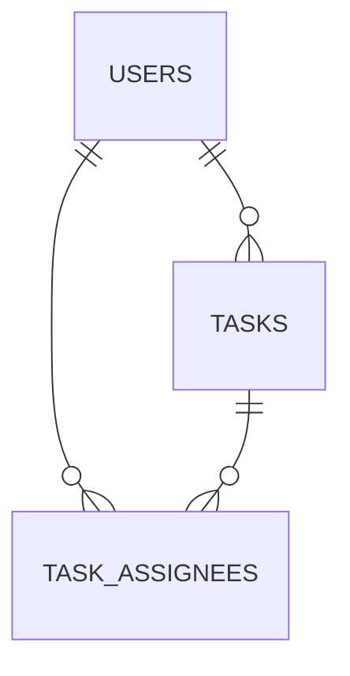
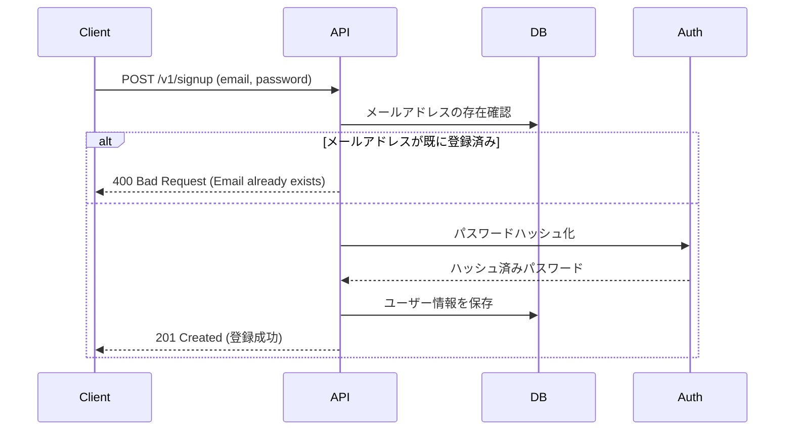
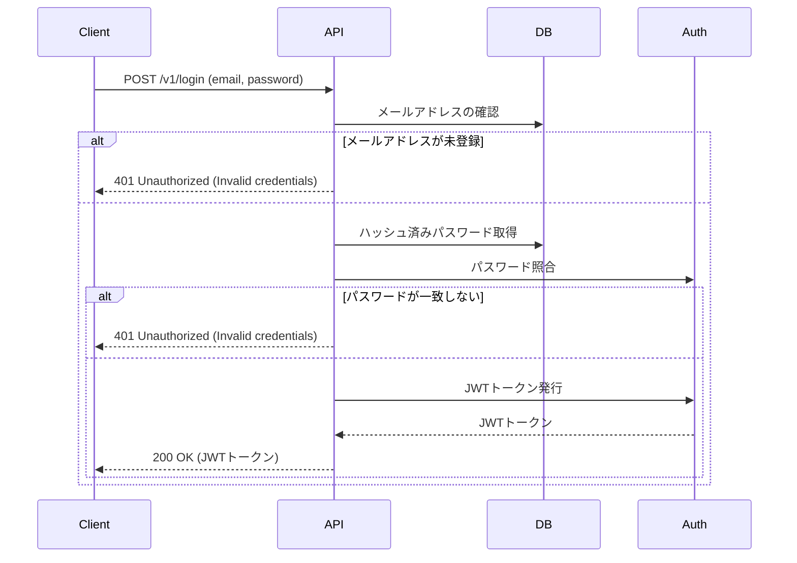
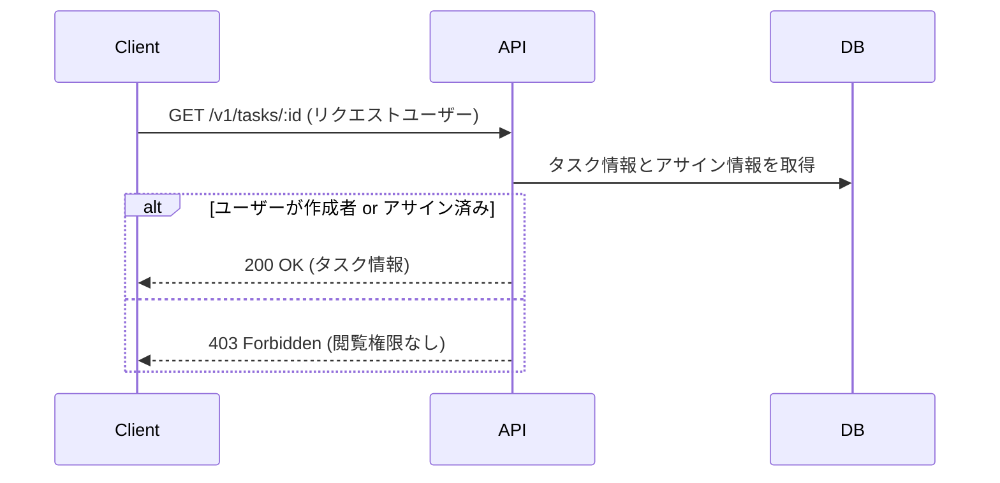
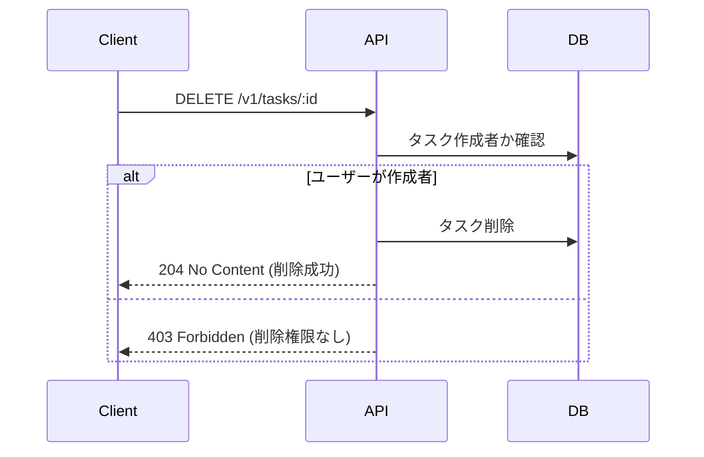
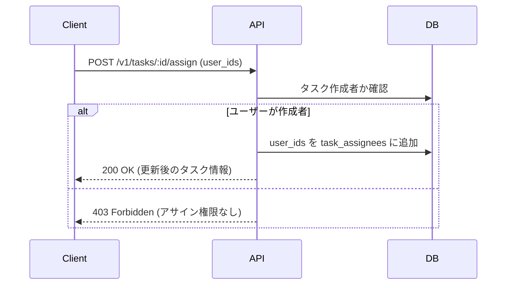
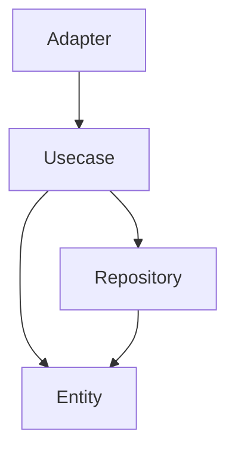

# 要件

- ユーザー認証（サインアップ・ログイン・ログアウト）機能
- 認証されたユーザーが自分のタスクを管理できる (CRUD) エンドポイント
  - タスク： title, description, dueDate などを保有
- 適切なデータベース設計を行い、DB にデータを保存する
- タスクの一覧・詳細取得、作成、編集、削除に対応
- 他のユーザーのタスクは閲覧・操作できないように認可を実装する
- タスク作成者は他のユーザー(複数名)をタスクにアサインできる

追加要件整理

- タスクの閲覧と編集は、作成者とアサイン者のみ
- タスクの削除は作成者のみ

# DB 設計

users
| 名前 | 型 | 制約 | Nullable | インデックス | 備考 |
| ------------- | --------- | ------ | -------- | --------------- | ---- |
| id | UUID | PK | - | | |
| name | VARCHAR | | - | | |
| email | VARCHAR | UNIQUE | - | idx_users_email | |
| password_hash | VARCHAR | | - | | |
| created_at | TIMESTAMP | | | | |
| updated_at | TIMESTAMP | | | | |

tasks
| 名前 | 型 | 制約 | Nullable | インデックス | 備考 |
| ----------- | ------- | ---- | -------- | ----------------- | ------- |
| id | UUID | PK | - | | |
| user_id | UUID | FK | - | idx_tasks_user_id | |
| title | VARCHAR | | - | | |
| description | TEXT | | - | | |
| status | INT | | - | | TODO: 1 |
IN_PROGRESS: 2
DONE: 3 |
| due_date | TIMESTAMP | | true | | |
| created_at | TIMESTAMP | | | | |
| updated_at | TIMESTAMP | | | | |

task_assignees
| 名前 | 型 | 制約 | Nullable | インデックス | 備考 |
| ----------- | --------- | ---- | -------- | -------------------------- | ---- |
| id | UUID | PK | - | | |
| task_id | UUID | FK | - | idx_task_assignees_task_id | |
| user_id | UUID | FK | - | idx_task_assignees_user_id | |
| assigned_at | TIMESTAMP | | - | | |
| created_at | TIMESTAMP | | | | |
| updated_at | TIMESTAMP | | | | |



# API 設計

## エンドポイント一覧

| URI                 | メソッド | 用途           | キー       | 備考                                           |
| ------------------- | -------- | -------------- | ---------- | ---------------------------------------------- |
| v1/signup           | POST     | 新規登録       | SingUp     |                                                |
| v1/login            | POST     | ログイン       | Login      |                                                |
| v1/tasks/:id        | GET      | タスク取得     | GetTask    | 作成したタスクとアサインされたタスクのみ閲覧可 |
| v1/tasks            | GET      | タスク一覧取得 | ListTasks  | 作成したタスクとアサインされたタスクのみ閲覧可 |
| v1/tasks            | POST     | タスク作成     | CreateTask | 作成したタスクとアサインされたタスクのみ閲覧可 |
| v1/tasks/:id        | PUT      | タスク更新     | UpdateTask | 作成したタスクとアサインされたタスクのみ編集可 |
| v1/tasks/:id        | DELETE   | タスク削除     | DeleteTask | 作成者のみ削除可                               |
| v1/tasks/:id/assign | POST     | タスク割り当て | AssignTask | 作成者のみアサイン可                           |

## シーケンス

SignUp

- In
  - name
  - email
  - password
- Out
  - user
  - jwt



Login

- In
  - email
  - password
- Out
  - jwt



GetTask

- Out
  - task



ListTasks

- Out
  - tasks
    省略

CreateTask

- In
  - user_id
  - titile
  - description
  - status
  - due_date
- Out
  - task
    省略
- UpdateTask

  - In
    - itile
    - description
    - status
    - due_date
  - Out
    - task

  ```mermaid
  sequenceDiagram
      participant Client
      participant API
      participant DB

      Client->>API: PUT /v1/tasks/:id (title, description, status, due_date)
      API->>DB: タスク作成者またはアサイン済みか確認
      alt ユーザーが作成者 or アサイン済み
          API->>DB: タスクを更新
          API-->>Client: 200 OK (更新後のタスク情報)
      else
          API-->>Client: 403 Forbidden (更新権限なし)
      end
  ```

DeleteTask



AssignTask

- In
  - user_ids
- Out
  - task



# アーキテクチャ

- シンプルなレイヤードアーキテクチャを採用
- テスタブルにするためにインターフェースを切って抽象に依存させる
- 役割
  - Adapter
    - ルーティング
    - ミドルウェア
  - Usecase
    - ビジネスロジック
  - Respository
    - 永続化
    - 外部通信
  - Entity
    - ドメインロジック



# 技術選定

- 言語
  - Go 1.22
- ORM・クエリビルダー
  - xo
- ルーティング
  - ogen
- 認証
  - jwt-go
- DB
  - PostgreSQL
- 通信
  - REST

選定の観点

- 認可周りで RLS が使えそうなので PostgreSQL を選定 (今回は使用しない)
- 各レイヤーの冗長な詰め替えをなくすため、コード生成系の xo や ogen を使用
